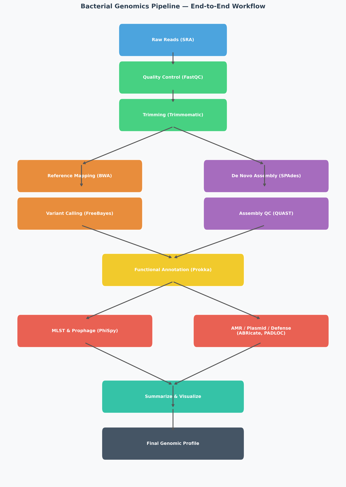

# BactoFlow



A fully **reproducible**, **resumable**, end-to-end bioinformatics pipeline for bacterial whole-genome analysis. Given an SRA accession ID, it performs:

- Raw read download (SRA)
- Quality control (FastQC, MultiQC)
- Adapter trimming (Trimmomatic)
- Reference mapping (BWA-MEM, SAMtools)
- Variant calling (FreeBayes)
- De novo genome assembly (SPAdes)
- Assembly quality assessment (QUAST)
- Functional annotation (Prokka)
- Downstream: MLST, AMR/Virulence/Plasmid screening (ABRicate), Defense systems (PADLOC), Prophage detection (PhiSpy)
- Scientific figures (Matplotlib/Seaborn)

---

## Requirements

- **Conda / Mamba** (Miniconda or Anaconda)
- **Linux / macOS**
- ~20 GB disk space (for a typical bacterial genome run)

---

## Quickstart

### 1. Clone the repository

```bash
git clone https://github.com/YOUR_USERNAME/BactoFlow.git
cd BactoFlow
```

### 2. Set your SRA accession

Edit `data/accession.txt` and put your SRA run ID (one per line):

```
SRR33893847
```

### 3. Add a reference genome (required for mapping/variant calling)

Place your reference FASTA at:

```
data/reference/reference.fasta
```

### 4. Install all conda environments & databases

```bash
bash install_environments.sh
```

This installs all tools (FastQC, Trimmomatic, BWA, SPAdes, Prokka, etc.) and
downloads all ABRicate, MLST, and PADLOC databases.

### 5. Run the pipeline

```bash
bash RUN_PIPELINE.sh
```

---

## Using Pre-existing Raw Reads

If you already have your sequencing data (e.g., from a sequencing facility), you can skip the SRA download step:

1.  **Place your files** in `data/raw_reads/`.
2.  **Ensure correct naming**: Files must be named `{ID}_1.fastq` and `{ID}_2.fastq` (or `.fastq.gz`).
3.  **Update `data/accession.txt`**: Add your `{ID}` to the file.
4.  **Run the pipeline**: 
    ```bash
    bash RUN_PIPELINE.sh
    ```
    The pipeline will detect the existing files, skip the download (Step 0), and proceed with QC and trimming. Both compressed (`.gz`) and uncompressed files are supported.

---

## Resuming an Interrupted Run

The pipeline tracks completed steps using checkpoint files in `results/.checkpoints/`.
If the pipeline is interrupted (power cut, timeout, etc.), simply re-run:

```bash
bash RUN_PIPELINE.sh
```

It will **automatically skip** all steps that already completed and continue from where it stopped.

### Force re-run from a specific step

```bash
bash RUN_PIPELINE.sh --from-step 6
```

This re-runs steps 6 onwards (SPAdes Assembly, QUAST, Prokka, etc.) even if they previously completed.

### List all step numbers

```bash
bash RUN_PIPELINE.sh --list-steps
```

| Step | Tool | Description |
|------|------|-------------|
| 0 | fasterq-dump | Download raw reads from SRA |
| 1 | FastQC | Raw read quality control |
| 2 | MultiQC | Aggregate QC report |
| 3 | Trimmomatic | Adapter trimming & quality filtering |
| 4 | BWA-MEM | Reference genome mapping |
| 5 | FreeBayes | Variant calling |
| 6 | SPAdes | De novo genome assembly |
| 7 | QUAST | Assembly quality assessment |
| 8 | Prokka | Functional gene annotation |
| 9 | MLST + ABRicate + PADLOC + PhiSpy | Downstream genomic analysis |
| 10 | summarize_results.py | Generate verification report |
| 11 | generate_workflow_figures.py | Assembly & annotation figures |
| 12 | generate_mapping_vcf_figures.py | Mapping & variant figures |
| 13 | generate_advanced_figures.py | AMR & defense system figures |
| 14 | generate_workflow_diagram.py | Pipeline workflow diagram |

---

## Directory Structure

```
BactoFlow/
├── RUN_PIPELINE.sh              # Master pipeline script
├── install_environments.sh      # Conda environment installer
├── data/
│   ├── accession.txt            # SRA accession ID(s)
│   ├── raw_reads/               # Downloaded FASTQ files (git-ignored)
│   └── reference/
│       └── reference.fasta      # Reference genome (add manually)
├── envs/                        # Conda environment YAML files
│   ├── ncbi-sra.yml
│   ├── fastqc.yml
│   ├── multiqc.yml
│   ├── trimmomatic.yml
│   ├── mapping.yml              # bwa + samtools + freebayes + tabix
│   ├── spades.yml
│   ├── quast.yml
│   ├── prokka.yml
│   ├── mlst.yml
│   ├── abricate.yml
│   ├── padloc.yml
│   └── phispy.yml
├── scripts/
│   ├── upstream/                # Steps 00–08
│   ├── downstream/              # Step 09
│   └── utils/                   # Helper Python scripts
├── visualization/               # Figure generation scripts (Steps 11–14)
└── results/                     # All outputs (git-ignored except structure)
    ├── .checkpoints/            # Step completion markers
    ├── figures/                 # Generated PNG figures
    ├── qc/                      # FastQC HTML reports
    ├── multiqc/                 # MultiQC HTML report
    ├── trimming/                # Trimmed FASTQ files
    ├── mapping/                 # BAM files
    ├── vcf/                     # Variant call VCF files
    ├── assembly/                # SPAdes assembly output
    ├── quast/                   # QUAST report
    ├── annotation/              # Prokka GFF/GBK/FAA files
    └── downstream/              # MLST, ABRicate, PADLOC, PhiSpy outputs
```

---

## Running Individual Steps Standalone

Each script is self-contained and can be run independently:

```bash
# Run only the assembly step
bash scripts/upstream/06_assembly.sh

# Run only downstream analysis
bash scripts/downstream/09_run_downstream_analysis.sh

# Generate figures only
python visualization/generate_advanced_figures.py
```

All scripts auto-detect the project root from their own location.

---

## Outputs

| Output | Location |
|--------|----------|
| FastQC reports | `results/qc/` |
| MultiQC report | `results/multiqc/multiqc_report.html` |
| Trimmed reads | `results/trimming/` |
| Sorted BAM | `results/mapping/{SRA_ID}.sorted.bam` |
| Variant calls | `results/vcf/{SRA_ID}.vcf.gz` |
| Assembly | `results/assembly/scaffolds.fasta` |
| QUAST report | `results/quast/report.tsv` |
| Annotation | `results/annotation/{SRA_ID}/{SRA_ID}.gbk` |
| MLST | `results/downstream/mlst_results.tsv` |
| ABRicate | `results/downstream/abricate/` |
| PADLOC | `results/downstream/padloc/` |
| PhiSpy | `results/downstream/phispy/` |
| Summary report | `results/downstream/downstream_verification_report.txt` |
| Figures | `results/figures/figure[0-8]_*.png` |
| Pipeline log | `results/pipeline.log` |

---

## Citation

If you use this pipeline, please cite the underlying tools:

- FastQC: Andrews, S. (2010). https://www.bioinformatics.babraham.ac.uk/projects/fastqc/
- MultiQC: Ewels et al. (2016). *Bioinformatics*, 32(19):3047–3048.
- Trimmomatic: Bolger et al. (2014). *Bioinformatics*, 30(15):2114–2120.
- BWA: Li & Durbin (2009). *Bioinformatics*, 25(14):1754–1760.
- FreeBayes: Garrison & Marth (2012). arXiv:1207.3907.
- SPAdes: Bankevich et al. (2012). *J. Comp. Biol.*, 19(5):455–477.
- QUAST: Gurevich et al. (2013). *Bioinformatics*, 29(8):1072–1075.
- Prokka: Seemann (2014). *Bioinformatics*, 30(14):2068–2069.
- MLST: Seemann T. https://github.com/tseemann/mlst
- ABRicate: Seemann T. https://github.com/tseemann/abricate
- PADLOC: Payne et al. (2022). *Nucleic Acids Res.*, 50(W1):W541–W550.
- PhiSpy: Akhter et al. (2012). *Nucleic Acids Res.*, 40(16):e126.
